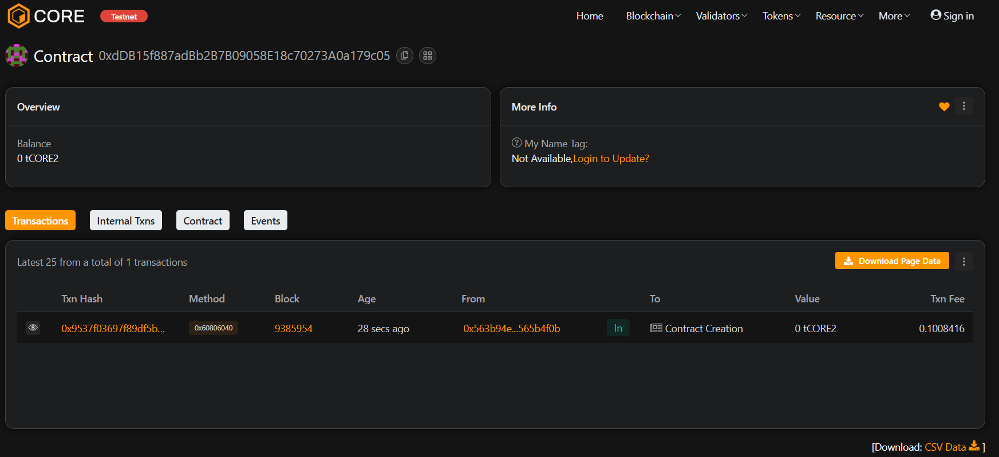

# 🏛️ MetaLock DAO

## 🧩 Project Description
**MetaLock DAO** is a decentralized autonomous organization (DAO) that enables members to propose, vote, and execute community-driven decisions securely on the blockchain. It focuses on decentralized governance and transparent execution of proposals.

---

## 🌐 Project Vision
To empower blockchain communities with transparent and secure decision-making, removing centralized control and promoting member-driven governance.

---

## ⚙️ Key Features
- Add and manage DAO members  
- Create and track proposals  
- Vote on proposals transparently  
- Execute approved proposals  

---

## 🚀 Future Scope
- Token-based voting mechanism  
- Multi-signature proposal execution  
- Integration with treasury smart contracts  
- Front-end DApp for proposal visualization  
- On-chain governance analytics  

---

## 🧰 Tech Stack
- Solidity (Smart Contract)  
- Hardhat (Development Framework)  
- Ethereum (Blockchain)  
- JavaScript (Testing & Deployment)

---

## 📜 License
This project is licensed under the MIT License.

Contract add : 0xdDB15f887adBb2B7B09058E18c70273A0a179c05
